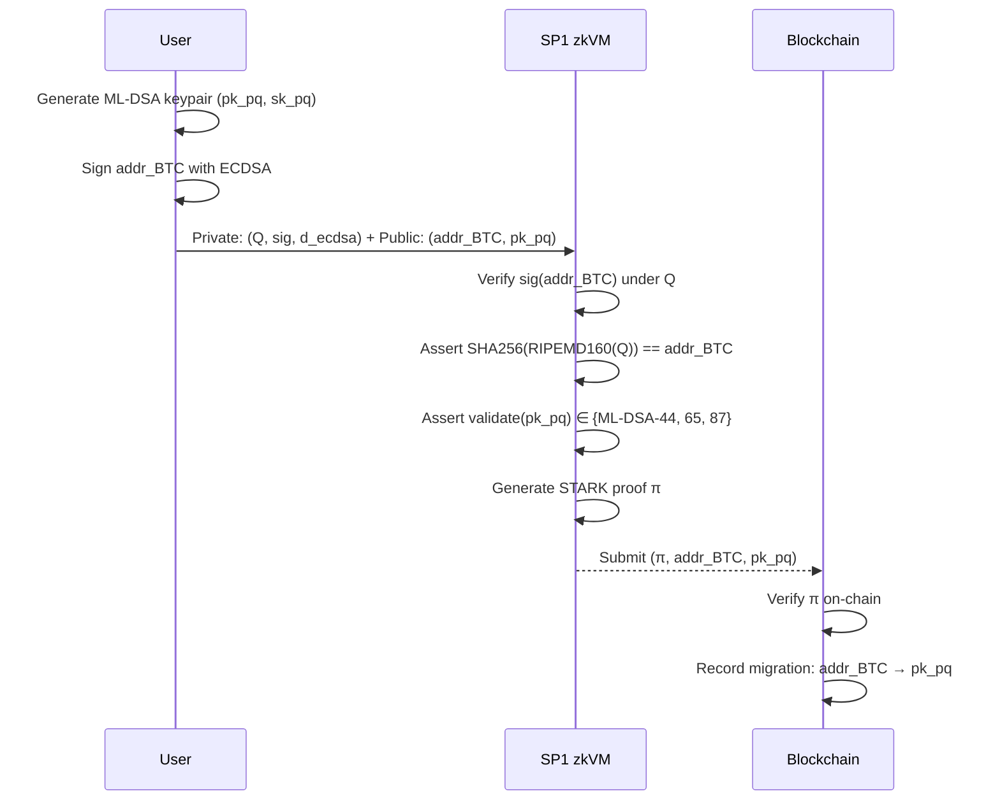
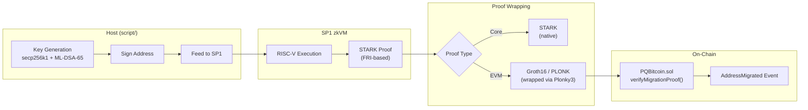
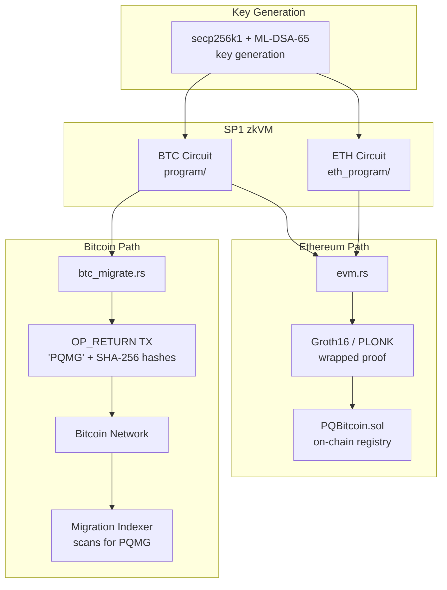
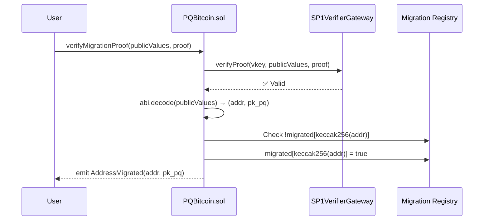

# PQ Bitcoin — Migrating Bitcoin and Ethereum Addresses to the Quantum Blockchain Era

A **post-quantum Bitcoin and Ethereum address migration framework** built on SP1 zkVM, implementing the research paper *"Quantum-Resistant Framework for Bitcoin and Ethereum Using Post-Quantum Signatures and STARK Circuits"*.

---

## Table of Contents

- [Motivation](#motivation)
- [Cryptographic Foundations](#cryptographic-foundations)
- [Migration Protocol](#migration-protocol)
- [ZK-STARK Circuit Design](#zk-stark-circuit-design)
- [Architecture](#architecture)
- [Post-Quantum Cryptography: ML-DSA](#post-quantum-cryptography-ml-dsa)
- [On-Chain Verification](#on-chain-verification)
- [Quick Start](#quick-start)
- [Test Coverage](#test-coverage)
- [References](#references)

---

## Motivation

Current blockchain cryptography relies on the **Elliptic Curve Digital Signature Algorithm (ECDSA)** over the secp256k1 curve. Shor's algorithm, running on a sufficiently powerful quantum computer, can solve the Elliptic Curve Discrete Logarithm Problem (ECDLP) in polynomial time:

$$
\text{Given } Q = d \cdot G \text{ on } E(\mathbb{F}_p), \quad \text{find } d \in \mathbb{Z}_n
$$

where $G$ is the generator point, $d$ is the private key, and $Q$ is the public key. Classically this requires $O(\sqrt{n})$ operations (Pollard's rho). Shor's algorithm reduces it to $O(\log^2 n)$ quantum gates.

**This project provides a migration path**: users prove ownership of their existing ECDSA-secured address and cryptographically bind it to a new **ML-DSA (CRYSTALS-Dilithium)** post-quantum public key — all within a zero-knowledge proof.

---

## Cryptographic Foundations

### 1. Bitcoin Address Derivation (P2PKH)

A Pay-to-Public-Key-Hash address is derived from a compressed ECDSA public key $Q$ through a cascade of hash functions:

```
                ┌───────────┐      ┌────────────┐      ┌──────────┐
  Q (33 bytes)  │  SHA-256   │─────▶│ RIPEMD-160  │─────▶│  H (20B)  │
                └───────────┘      └────────────┘      └──────────┘
                                                            │
                                                   ┌───────▼───────┐
                                                   │  0x00 ‖ H     │ (21 bytes)
                                                   └───────┬───────┘
                                                           │
                                              ┌────────────▼────────────┐
                                              │ SHA-256(SHA-256(0x00‖H))│
                                              └────────────┬────────────┘
                                                           │
                                                    ┌──────▼──────┐
                                                    │ Checksum[0:4]│
                                                    └──────┬──────┘
                                                           │
                                              ┌────────────▼────────────┐
                                              │  0x00 ‖ H ‖ Checksum   │ = Address (25 bytes)
                                              └─────────────────────────┘
```

Formally:

$$
H = \text{RIPEMD-160}(\text{SHA-256}(Q))
$$

$$
C = \text{SHA-256}(\text{SHA-256}(0\text{x}00 \| H))[0{:}4]
$$

$$
\text{Address} = 0\text{x}00 \| H \| C
$$

The critical insight is that the public key $Q$ is protected by a **double hash barrier**. As long as $Q$ has never been revealed on-chain (the UTXO remains unspent), an attacker cannot derive $d$ even with a quantum computer.

### 2. Ethereum Address Derivation

Ethereum uses the raw uncompressed public key (64 bytes, sans `0x04` prefix) with Keccak-256:

$$
\text{Address}_{\text{ETH}} = \text{Keccak-256}(Q_x \| Q_y)[12{:}32]
$$

where $Q_x, Q_y \in \mathbb{F}_p$ are the affine coordinates of the public key point, and we take the **last 20 bytes** of the 32-byte hash.

> **Note:** Ethereum uses Keccak-256 (the pre-standardization version), **not** NIST SHA-3. The two produce different outputs despite both being Keccak family members.

### 3. ECDSA Signature Verification

Both circuits verify ECDSA signatures over secp256k1. Given:
- Generator $G \in E(\mathbb{F}_p)$ with order $n$
- Private key $d \in [1, n-1]$
- Public key $Q = d \cdot G$
- Message hash $e = H(m)$
- Signature $(r, s) \in \mathbb{Z}_n^2$

Verification computes:

$$
u_1 = e \cdot s^{-1} \mod n
$$

$$
u_2 = r \cdot s^{-1} \mod n
$$

$$
R = u_1 \cdot G + u_2 \cdot Q
$$

$$
\text{Valid} \iff R_x \equiv r \pmod{n}
$$

---

## Migration Protocol

The paper defines two migration paths depending on public-key exposure:

### Path A: Unexposed Public Keys (UTXOs Never Spent)

For addresses whose public key $Q$ has never appeared on-chain, the hash barrier provides quantum protection. The migration uses a **zkSTARK proof** to demonstrate knowledge of the private key without revealing it:



**Key property:** The ECDSA public key $Q$ remains private (inside the zkSTARK witness). Only the address and PQ key are revealed.

### Path B: Exposed Public Keys (Spent UTXOs)

For addresses whose $Q$ is already public (from previous spending transactions), the migration uses a **hybrid dual-signature** approach:

$$
\text{MigrationTx} = \text{Sign}_{\text{ECDSA}}(m, d) \| \text{Sign}_{\text{ML-DSA}}(m, sk_{pq}) \| \pi_{\text{STARK}}
$$

The zkSTARK proof $\pi$ binds the two keys together, proving they belong to the same entity. The paper proposes new Bitcoin opcodes for this:

- `OP_CHECKQUANTUMSIG` — Verifies PQ signature + STARK proof
- `OP_CHECKSTARKPROOF` — Verifies only the STARK proof

---

## ZK-STARK Circuit Design

### Bitcoin Circuit (`program/`)

The STARK circuit for Bitcoin migration validates three conditions as a single atomic proof:

$$
\pi_{\text{BTC}} = \text{STARK}\{(Q, \sigma) : \text{Verify}(\sigma, Q, \text{addr}) \land \text{Derive}(Q) = \text{addr} \land \text{Valid}(pk_{pq})\}
$$

| Input Type | Variable | Description |
|------------|----------|-------------|
| Private | $Q$ | Compressed ECDSA public key (33 bytes) |
| Private | $\sigma$ | ECDSA signature (64 bytes, compact) |
| Public | $\text{addr}$ | P2PKH Bitcoin address (25 bytes) |
| Public | $pk_{pq}$ | ML-DSA public key (1312/1952/2592 bytes) |

**Circuit constraints:**

1. $\text{ECDSA.Verify}(\sigma, Q, \text{SHA-256}(\text{addr})) = \text{true}$
2. $0\text{x}00 \| \text{RIPEMD-160}(\text{SHA-256}(Q)) \| C = \text{addr}$
3. $|pk_{pq}| \in \{1312, 1952, 2592\}$

### Ethereum Circuit (`eth_program/`)

$$
\pi_{\text{ETH}} = \text{STARK}\{(Q, \sigma) : \text{Verify}(\sigma, Q, \text{addr}) \land \text{Keccak-256}(Q)[12{:}] = \text{addr} \land \text{Valid}(pk_{pq})\}
$$

| Input Type | Variable | Description |
|------------|----------|-------------|
| Private | $Q$ | Uncompressed ECDSA public key (65 bytes, with `0x04` prefix) |
| Private | $\sigma$ | ECDSA signature (64 bytes) |
| Public | $\text{addr}$ | Ethereum address (20 bytes) |
| Public | $pk_{pq}$ | ML-DSA public key |

### Proof Pipeline



The SP1 prover uses the **FRI (Fast Reed-Solomon Interactive Oracle Proof)** protocol internally:

1. **Trace generation:** Execute the RISC-V program, record all register/memory states
2. **Polynomial commitment:** Encode trace as polynomials over a finite field $\mathbb{F}_p$
3. **Constraint checking:** Verify AIR (Algebraic Intermediate Representation) constraints
4. **FRI folding:** Compress polynomial degree via repeated halving
5. **Wrapping (optional):** Convert STARK → Groth16/PLONK for EVM verification ($O(1)$ on-chain gas)

---

## Architecture

```
pq_bitcoin/
├── lib/                        # Shared library
│   └── src/
│       ├── lib.rs              # BTC/ETH derivation, ML-DSA constants, 28 unit tests
│       └── op_return.rs        # OP_RETURN payload format, script gen/parse, 32 tests
│
├── program/                    # BTC zkVM circuit (SP1 guest)
│   └── src/main.rs             # ECDSA verify + P2PKH derive + PQ validate
│
├── eth_program/                # ETH zkVM circuit (SP1 guest)
│   └── src/main.rs             # ECDSA verify + Keccak-256 derive + PQ validate
│
├── script/                     # Host-side orchestration
│   └── src/bin/
│       ├── main.rs             # Key gen (secp256k1 + ML-DSA-65), execute/prove
│       ├── evm.rs              # EVM proof generation + fixture JSON output
│       ├── btc_migrate.rs      # OP_RETURN migration payload generator
│       └── vkey.rs             # Print verification key
│
├── contracts/                  # Solidity on-chain verifier (Ethereum path)
│   ├── src/PQBitcoin.sol       # Migration verifier (12/12 tests, 100% coverage)
│   └── test/PQBitcoin.t.sol    # Foundry tests (Groth16 + PLONK suites)
│
└── docs/                       # Research paper (PDF)
```

### Dual Verification Paths



---

## Post-Quantum Cryptography: ML-DSA

### Algorithm Overview

ML-DSA (Module-Lattice-Based Digital Signature Algorithm), formerly CRYSTALS-Dilithium, is standardized in [FIPS-204](https://csrc.nist.gov/pubs/fips/204/final). Its security is based on the hardness of the **Module Learning With Errors (MLWE)** problem:

$$
\text{Given } (\mathbf{A}, \mathbf{t} = \mathbf{A} \cdot \mathbf{s}_1 + \mathbf{s}_2) \in R_q^{k \times \ell} \times R_q^k, \quad \text{find } \mathbf{s}_1, \mathbf{s}_2 \text{ with small coefficients}
$$

where $R_q = \mathbb{Z}_q[X]/(X^n + 1)$ is a polynomial ring with $n = 256$, $q = 8380417$.

### Key Generation

```
KeyGen():
    ρ, ρ', K ← {0,1}^256                    // Random seeds
    A ← ExpandA(ρ) ∈ R_q^{k×ℓ}              // Public matrix (from seed)
    (s₁, s₂) ← ExpandS(ρ') ∈ R_q^ℓ × R_q^k  // Short secret vectors
    t = A · s₁ + s₂                          // Public key vector
    return (pk = (ρ, t), sk = (ρ, K, s₁, s₂, t))
```

### Parameter Sets

| Parameter | ML-DSA-44 | **ML-DSA-65** | ML-DSA-87 |
|-----------|-----------|---------------|-----------|
| NIST Security Level | 2 | **3** | 5 |
| $(k, \ell)$ | $(4, 4)$ | **(6, 5)** | $(8, 7)$ |
| $\eta$ (secret bound) | 2 | **4** | 2 |
| Public Key Size | 1,312 B | **1,952 B** | 2,592 B |
| Signature Size | 2,420 B | **3,309 B** | 4,627 B |
| Classical Security | 128-bit | **192-bit** | 256-bit |
| Quantum Security | ~AES-128 | **~AES-192** | ~AES-256 |

This project defaults to **ML-DSA-65** (NIST Level 3), providing 192-bit classical and approximately AES-192 quantum security.

### Why Module Lattices?

Unlike RSA and ECDSA (which fall to Shor's algorithm), lattice problems have no known efficient quantum algorithm:

| Problem | Classical | Quantum |
|---------|-----------|---------|
| Integer Factoring (RSA) | Sub-exponential | **Poly-time (Shor)** ⚠️ |
| ECDLP (ECDSA) | $O(\sqrt{n})$ | **Poly-time (Shor)** ⚠️ |
| MLWE (ML-DSA) | Exponential | **Exponential** ✅ |
| Unstructured LWE | Exponential | **Exponential** ✅ |

---

## On-Chain Verification

### PQBitcoin.sol Contract

```solidity
struct PublicValuesStruct {
    bytes btc_address;   // P2PKH address (25 bytes) or ETH address (20 bytes)
    bytes pq_pubkey;     // ML-DSA public key (1312/1952/2592 bytes)
}
```

**Verification flow:**



**Security features:**
- **Replay protection:** `mapping(bytes32 => bool) migrated` prevents double-migration
- **Proof integrity:** SP1VerifierGateway validates the STARK-to-Groth16/PLONK wrapped proof
- **View-only mode:** `verifyMigrationProofView()` for stateless verification without state changes

---

## Quick Start

### Requirements

- [Rust](https://rustup.rs/) (stable, edition 2024)
- [SP1](https://docs.succinct.xyz/docs/sp1/getting-started/install) (v5.0.4)
- [Foundry](https://book.getfoundry.sh/getting-started/installation) (for Solidity tests)

### 1. Execute (No Proof)

```sh
cd script
cargo run --release -- --execute
```

Generates fresh secp256k1 + ML-DSA-65 keypairs, derives BTC address, runs the zkVM program, and reports cycle count.

### 2. Generate Proof

```sh
cd script
cargo run --release -- --prove --prove-type=normal   # STARK proof
cargo run --release -- --prove --prove-type=groth     # Groth16 (EVM)
cargo run --release -- --prove --prove-type=plonk     # PLONK (EVM)
```

### 3. Generate EVM Fixtures

```sh
cd script
cargo run --release --bin evm -- --system groth16
cargo run --release --bin evm -- --system plonk
```

### 4. Generate OP_RETURN Migration Payload (Bitcoin Path)

```sh
cd script
cargo run --release --bin btc_migrate              # random keys
cargo run --release --bin btc_migrate -- --format hex # raw script hex
```

### 5. Run All Tests

```sh
# ── Rust library tests (62 tests) ──────────────────────────────
cargo test --package pq_bitcoin-lib

# ── Solidity contract tests (12 tests) ─────────────────────────
cd contracts && forge test -vvv

# ── Rust coverage report ───────────────────────────────────────
cargo llvm-cov --package pq_bitcoin-lib

# ── Solidity coverage report ───────────────────────────────────
cd contracts && forge coverage

# ── Run everything at once ─────────────────────────────────────
cargo test --package pq_bitcoin-lib && cd contracts && forge test -vvv && cd ..
```

---

## Test Coverage

### Rust Library — 62 Tests

| Category | Tests | What's Covered |
|----------|-------|----------------|
| BTC Address | 6 | Valid derivation, determinism, invalid/too-long keys, checksum, 0x03 prefix, uniqueness |
| ETH Address | 5 | Length, known Keccak vector, determinism, invalid/too-long keys, uniqueness |
| PQ Validation | 7 | ML-DSA-44/65/87 valid, invalid/empty, boundary sizes (±1 byte each) |
| Level Names | 4 | ML-DSA-44/65/87 names, unknown size |
| ABI Encoding | 4 | Roundtrip, empty fields, large key (2592B), SolValue trait |
| Constants | 1 | ML_DSA_65_PK_SIZE, ML_DSA_65_SIG_SIZE, min/max sizes |
| OP_RETURN Encode/Decode | 8 | Roundtrip, size within 80B, magic/version, wrong magic/version, too short, empty |
| Hash Commitments | 4 | Valid/invalid PQ key hash, valid/invalid proof hash |
| ML-DSA Level Detection | 4 | Auto-detect 44/65/87 from key size, unknown |
| Flags | 6 | Groth16, PLONK, dual-sig, combined, none, preserved through encode/decode |
| Script Gen/Parse | 7 | to_script, is_migration_script (valid, non-OP_RETURN, wrong magic, empty), from_script roundtrip, invalid, direct push |
| Constructors & Determinism | 3 | from_hashes, deterministic encoding, different keys/proofs |
| **Total** | **62** | |

### Solidity Contracts — 12 Tests (100% Coverage)

| Suite | Tests | What's Covered |
|-------|-------|----------------|
| Groth16 | 8 | Valid proof, view-only, replay protection, isMigrated, event emission, invalid proof revert, multi-address migration, constructor state |
| PLONK | 4 | Valid proof, view-only, replay protection, invalid proof revert |
| **Total** | **12** | **100%** lines, statements, branches, functions |

---

## References

1. *"Quantum-Resistant Framework for Bitcoin and Ethereum Using Post-Quantum Signatures and STARK Circuits"* — Research paper (included in `docs/`)
2. [FIPS-204: Module-Lattice-Based Digital Signature Standard](https://csrc.nist.gov/pubs/fips/204/final) — ML-DSA specification
3. [SP1 Documentation](https://docs.succinct.xyz/docs/sp1/getting-started/install) — zkVM framework
4. [RustCrypto/ml-dsa](https://github.com/RustCrypto/signatures/tree/master/ml-dsa) — Rust ML-DSA implementation
5. [Bitcoin Wiki: Technical Background of Addresses](https://en.bitcoin.it/wiki/Technical_background_of_version_1_Bitcoin_addresses) — P2PKH derivation

## License

MIT
