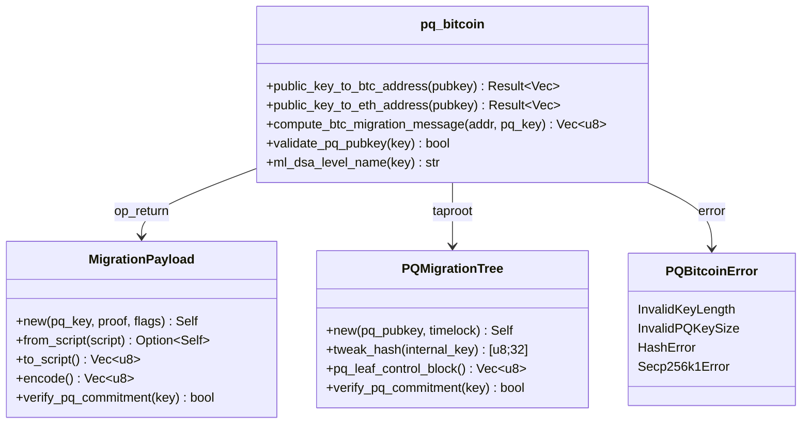
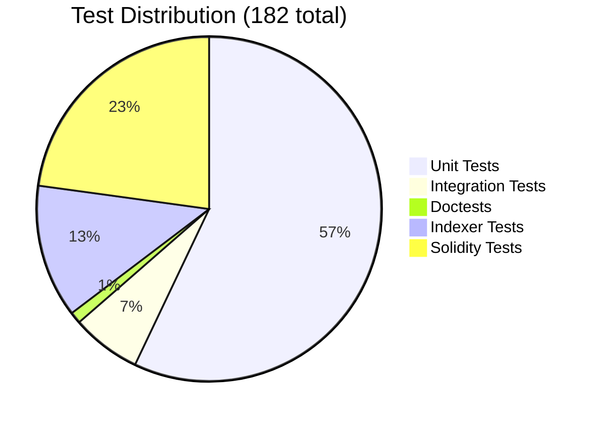

# PQ Bitcoin — Migrating Bitcoin and Ethereum Addresses to the Quantum Blockchain Era

A **post-quantum Bitcoin and Ethereum address migration SDK** built on SP1 zkVM, implementing the research paper *"Quantum-Resistant Framework for Bitcoin and Ethereum Using Post-Quantum Signatures and STARK Circuits"*.

```mermaid
flowchart LR
    subgraph SDK["pq-bitcoin SDK"]
        A["🔑 ECDSA Key"] --> B["📍 BTC/ETH Address"]
        C["🛡️ ML-DSA Key"] --> D["📦 Migration Payload"]
        B --> D
        D --> E{"Path"}
    end

    E -->|Bitcoin L1| F["OP_RETURN TX"]
    E -->|Taproot| G["P2TR Address"]
    E -->|EVM| H["SP1 zkProof"]

    F --> I["🔍 Indexer"]
    H --> J["📜 PQBitcoin.sol"]
```



---

## Table of Contents

- [SDK Installation](#sdk-installation)
- [Motivation](#motivation)
- [Cryptographic Foundations](#cryptographic-foundations)
- [Migration Protocol](#migration-protocol)
- [ZK-STARK Circuit Design](#zk-stark-circuit-design)
- [Architecture](#architecture)
- [Post-Quantum Cryptography: ML-DSA](#post-quantum-cryptography-ml-dsa)
- [On-Chain Verification](#on-chain-verification)
- [CLI Tools](#cli-tools)
- [Migration Indexer](#migration-indexer)
- [Quick Start](#quick-start)
- [Test Coverage](#test-coverage)
- [References](#references)

---

## SDK Installation

Add the library to your Rust project:

```sh
cargo add pq-bitcoin
```

### Quick Example

```rust
use pq_bitcoin::{public_key_to_btc_address, validate_pq_pubkey};
use pq_bitcoin::op_return::MigrationPayload;

// Derive BTC address from compressed ECDSA public key
let pubkey = hex::decode("0279be66...f81798").unwrap();
let address = public_key_to_btc_address(&pubkey).unwrap();

// Create OP_RETURN migration payload
let pq_key = vec![0xAA; 1952]; // ML-DSA-65 public key
let proof = vec![0xBB; 256];    // STARK proof bytes
let payload = MigrationPayload::new(&pq_key, &proof, 0);
let script = payload.to_script(); // Ready for Bitcoin TX
```

### SDK API Overview



> See [`examples/basic_migration.rs`](examples/basic_migration.rs) and [`examples/taproot_commitment.rs`](examples/taproot_commitment.rs) for full working examples.

---

## Motivation

Current blockchain cryptography relies on the **Elliptic Curve Digital Signature Algorithm (ECDSA)** over the secp256k1 curve. Shor's algorithm, running on a sufficiently powerful quantum computer, can solve the Elliptic Curve Discrete Logarithm Problem (ECDLP) in polynomial time:

$$
\text{Given } Q = d \cdot G \text{ on } E(\mathbb{F}_p), \quad \text{find } d \in \mathbb{Z}_n
$$

where $G$ is the generator point, $d$ is the private key, and $Q$ is the public key. Classically this requires $O(\sqrt{n})$ operations (Pollard's rho). Shor's algorithm reduces it to $O(\log^2 n)$ quantum gates.

**This project provides a migration path**: users prove ownership of their existing ECDSA-secured address and cryptographically bind it to a new **ML-DSA (CRYSTALS-Dilithium)** post-quantum public key — all within a zero-knowledge proof.

---

## Cryptographic Foundations

### 1. Bitcoin Address Derivation (P2PKH)

A Pay-to-Public-Key-Hash address is derived from a compressed ECDSA public key $Q$ through a cascade of hash functions:

```
                ┌───────────┐      ┌────────────┐      ┌──────────┐
  Q (33 bytes)  │  SHA-256   │─────▶│ RIPEMD-160  │─────▶│  H (20B)  │
                └───────────┘      └────────────┘      └──────────┘
                                                            │
                                                   ┌───────▼───────┐
                                                   │  0x00 ‖ H     │ (21 bytes)
                                                   └───────┬───────┘
                                                           │
                                              ┌────────────▼────────────┐
                                              │ SHA-256(SHA-256(0x00‖H))│
                                              └────────────┬────────────┘
                                                           │
                                                    ┌──────▼──────┐
                                                    │ Checksum[0:4]│
                                                    └──────┬──────┘
                                                           │
                                              ┌────────────▼────────────┐
                                              │  0x00 ‖ H ‖ Checksum   │ = Address (25 bytes)
                                              └─────────────────────────┘
```

Formally:

$$
H = \text{RIPEMD-160}(\text{SHA-256}(Q))
$$

$$
C = \text{SHA-256}(\text{SHA-256}(0\text{x}00 \| H))[0{:}4]
$$

$$
\text{Address} = 0\text{x}00 \| H \| C
$$

The critical insight is that the public key $Q$ is protected by a **double hash barrier**. As long as $Q$ has never been revealed on-chain (the UTXO remains unspent), an attacker cannot derive $d$ even with a quantum computer.

### 2. Ethereum Address Derivation

Ethereum uses the raw uncompressed public key (64 bytes, sans `0x04` prefix) with Keccak-256:

$$
\text{Address}_{\text{ETH}} = \text{Keccak-256}(Q_x \| Q_y)[12{:}32]
$$

where $Q_x, Q_y \in \mathbb{F}_p$ are the affine coordinates of the public key point, and we take the **last 20 bytes** of the 32-byte hash.

> **Note:** Ethereum uses Keccak-256 (the pre-standardization version), **not** NIST SHA-3. The two produce different outputs despite both being Keccak family members.

### 3. ECDSA Signature Verification

Both circuits verify ECDSA signatures over secp256k1. Given:
- Generator $G \in E(\mathbb{F}_p)$ with order $n$
- Private key $d \in [1, n-1]$
- Public key $Q = d \cdot G$
- Message hash $e = H(m)$
- Signature $(r, s) \in \mathbb{Z}_n^2$

Verification computes:

$$
u_1 = e \cdot s^{-1} \mod n
$$

$$
u_2 = r \cdot s^{-1} \mod n
$$

$$
R = u_1 \cdot G + u_2 \cdot Q
$$

$$
\text{Valid} \iff R_x \equiv r \pmod{n}
$$

---

## Migration Protocol

The paper defines two migration paths depending on public-key exposure:

### Path A: Unexposed Public Keys (UTXOs Never Spent)

For addresses whose public key $Q$ has never appeared on-chain, the hash barrier provides quantum protection. The migration uses a **zkSTARK proof** to demonstrate knowledge of the private key without revealing it:

```mermaid
sequenceDiagram
    participant User
    participant SP1 as SP1 zkVM
    participant Chain as Blockchain

    User->>User: Generate ML-DSA keypair (pk_pq, sk_pq)
    User->>User: Compute m = SHA-256("PQ-MIG" ‖ addr ‖ SHA-256(pk_pq))
    User->>User: Sign migration msg with ECDSA
    User->>SP1: Private: (Q, sig) + Public: (addr_BTC, pk_pq)
    SP1->>SP1: Rebuild m, verify ECDSA.Verify(Q, m, sig)
    SP1->>SP1: Assert RIPEMD160(SHA256(Q)) == addr_BTC
    SP1->>SP1: Assert validate(pk_pq) ∈ {ML-DSA-44, 65, 87}
    SP1->>SP1: Generate STARK proof π
    SP1-->>Chain: Submit (π, addr_BTC, pk_pq)
    Chain->>Chain: Verify π on-chain
    Chain->>Chain: Record migration: addr_BTC → pk_pq
```



**Key property:** The ECDSA public key $Q$ remains private (inside the zkSTARK witness). Only the address and PQ key are revealed.

### Path B: Exposed Public Keys (Spent UTXOs)

For addresses whose $Q$ is already public (from previous spending transactions), the migration uses a **hybrid dual-signature** approach:

$$
\text{MigrationTx} = \text{Sign}_{\text{ECDSA}}(m, d) \| \text{Sign}_{\text{ML-DSA}}(m, sk_{pq}) \| \pi_{\text{STARK}}
$$

The zkSTARK proof $\pi$ binds the two keys together, proving they belong to the same entity. The paper proposes new Bitcoin opcodes for this:

- `OP_CHECKQUANTUMSIG` — Verifies PQ signature + STARK proof
- `OP_CHECKSTARKPROOF` — Verifies only the STARK proof

---

## ZK-STARK Circuit Design

### Bitcoin Circuit (`program/`)

The STARK circuit for Bitcoin migration validates three conditions as a single atomic proof:

$$
\pi_{\text{BTC}} = \text{STARK}\{(Q, \sigma) : \text{Verify}(\sigma, Q, \text{addr}) \land \text{Derive}(Q) = \text{addr} \land \text{Valid}(pk_{pq})\}
$$

| Input Type | Variable | Description |
|------------|----------|-------------|
| Private | $Q$ | Compressed ECDSA public key (33 bytes) |
| Private | $\sigma$ | ECDSA signature (64 bytes, compact) |
| Public | $\text{addr}$ | P2PKH Bitcoin address (25 bytes) |
| Public | $pk_{pq}$ | ML-DSA public key (1312/1952/2592 bytes) |

**Circuit constraints:**

1. $m = \text{SHA-256}(\texttt{"PQ-MIG"} \| \text{addr} \| \text{SHA-256}(pk_{pq}))$, then $\text{ECDSA.Verify}(\sigma, Q, m) = \text{true}$
2. $0\text{x}00 \| \text{RIPEMD-160}(\text{SHA-256}(Q)) \| C = \text{addr}$
3. $|pk_{pq}| \in \{1312, 1952, 2592\}$

### Ethereum Circuit (`eth_program/`)

$$
\pi_{\text{ETH}} = \text{STARK}\{(Q, \sigma) : \text{Verify}(\sigma, Q, \text{addr}) \land \text{Keccak-256}(Q)[12{:}] = \text{addr} \land \text{Valid}(pk_{pq})\}
$$

| Input Type | Variable | Description |
|------------|----------|-------------|
| Private | $Q$ | Uncompressed ECDSA public key (65 bytes, with `0x04` prefix) |
| Private | $\sigma$ | ECDSA signature (64 bytes) |
| Public | $\text{addr}$ | Ethereum address (20 bytes) |
| Public | $pk_{pq}$ | ML-DSA public key |

### Proof Pipeline

```mermaid
graph LR
    subgraph "Host (script/)"
        A["Key Generation<br/>secp256k1 + ML-DSA-65"] --> B["Sign Migration Message<br/><small>m = SHA-256(PQ-MIG ‖ addr ‖ SHA-256(pk_pq))</small>"]
        B --> C["Feed to SP1"]
    end

    subgraph "SP1 zkVM"
        C --> D["RISC-V Execution"]
        D --> E["STARK Proof<br/>(FRI-based)"]
    end

    subgraph "Proof Wrapping"
        E --> F{"Proof Type"}
        F -->|Core| G["STARK<br/>(native)"]
        F -->|EVM| H["Groth16 / PLONK<br/>(wrapped via Plonky3)"]
    end

    subgraph "On-Chain"
        H --> I["PQBitcoin.sol<br/>verifyMigrationProof()"]
        I --> J["AddressMigrated Event"]
    end
```



The SP1 prover uses the **FRI (Fast Reed-Solomon Interactive Oracle Proof)** protocol internally:

1. **Trace generation:** Execute the RISC-V program, record all register/memory states
2. **Polynomial commitment:** Encode trace as polynomials over a finite field $\mathbb{F}_p$
3. **Constraint checking:** Verify AIR (Algebraic Intermediate Representation) constraints
4. **FRI folding:** Compress polynomial degree via repeated halving
5. **Wrapping (optional):** Convert STARK → Groth16/PLONK for EVM verification ($O(1)$ on-chain gas)

---

## Architecture

```mermaid
graph TD
    subgraph LIB["📦 pq-bitcoin (lib/)"]
        L1["lib.rs — BTC/ETH derivation, ML-DSA constants"]
        L2["error.rs — PQBitcoinError enum"]
        L3["op_return.rs — OP_RETURN payload format"]
        L4["taproot.rs — BIP-341 PQ commitment tree"]
    end

    subgraph CIRCUITS["⚡ SP1 zkVM Circuits"]
        P1["program/ — BTC circuit"]
        P2["eth_program/ — ETH circuit"]
    end

    subgraph HOST["🖥️ Host Scripts (script/)"]
        S1["main.rs — Key gen + execute/prove"]
        S2["evm.rs — EVM proof + fixture JSON"]
        S3["btc_migrate.rs — OP_RETURN generator"]
        S4["taproot_addr.rs — P2TR address gen"]
        S5["vkey.rs — Verification key"]
    end

    subgraph ONCHAIN["🔗 On-Chain"]
        C1["PQBitcoin.sol — Ownable2Step + Merkle registry"]
        C2["MerkleTree.sol — Incremental tree (depth 20)"]
        IX["indexer/ — REST API"]
    end

    LIB --> CIRCUITS
    LIB --> HOST
    HOST --> ONCHAIN
    CIRCUITS --> HOST
```



```
pq_bitcoin/
├── lib/                        # Core SDK library (crate: pq-bitcoin)
│   ├── src/
│   │   ├── lib.rs              # BTC/ETH derivation, migration message, ML-DSA constants, ABI types
│   │   ├── error.rs            # PQBitcoinError enum (SDK error handling)
│   │   ├── op_return.rs        # OP_RETURN payload format, script gen/parse
│   │   └── taproot.rs          # BIP-341 Taproot PQ commitment tree
│   └── tests/
│       └── btc_migrate_integration.rs  # 12 end-to-end integration tests
│
├── program/                    # BTC zkVM circuit (SP1 guest)
│   └── src/main.rs             # ECDSA verify + P2PKH derive + PQ validate
│
├── eth_program/                # ETH zkVM circuit (SP1 guest)
│   └── src/main.rs             # ECDSA verify + Keccak-256 derive + PQ validate
│
├── script/                     # Host-side orchestration
│   └── src/bin/
│       ├── main.rs             # Key gen (secp256k1 + ML-DSA-65), execute/prove
│       ├── evm.rs              # EVM proof generation + fixture JSON output
│       ├── btc_migrate.rs      # OP_RETURN migration payload generator
│       ├── taproot_addr.rs     # Taproot P2TR address generator with PQ commitments
│       └── vkey.rs             # Print verification key
│
├── contracts/                  # Solidity on-chain verifier (Ethereum path)
│   ├── src/
│   │   ├── PQBitcoin.sol       # Migration verifier + Ownable2Step + dual-sig
│   │   └── MerkleTree.sol      # Incremental Merkle tree (depth 20, ~1M slots)
│   └── test/PQBitcoin.t.sol    # Foundry tests (6 suites, 42 tests)
│
├── indexer/                    # Migration indexer service
│   └── src/main.rs             # REST API for scanning OP_RETURN migrations
│
├── examples/                   # SDK usage examples
│   ├── basic_migration.rs      # OP_RETURN payload workflow
│   └── taproot_commitment.rs   # Taproot PQ key commitment
│
├── docs/                       # Research paper + BIP draft
│   └── BIP-CHECKQUANTUMSIG.md  # OP_CHECKQUANTUMSIG BIP specification
│
├── CONTRIBUTING.md             # Contribution guidelines
├── SECURITY.md                 # Security policy & disclosure
└── LICENSE-MIT
```

### Dual Verification Paths

```mermaid
graph TD
    subgraph GEN["🔑 Key Generation"]
        A["secp256k1 + ML-DSA-65"]
    end

    subgraph ZK["⚡ SP1 zkVM"]
        A --> B["BTC Circuit"]
        A --> C["ETH Circuit"]
    end

    subgraph BTC["₿ Bitcoin Path"]
        B --> D["btc_migrate"]
        D --> E["OP_RETURN TX"]
        E --> F["Bitcoin L1"]
        F --> G["🔍 Indexer"]

        B --> TA["taproot_addr"]
        TA --> TB["P2TR Address"]
        TB --> F
    end

    subgraph ETH["Ξ Ethereum Path"]
        B --> H["evm.rs"]
        C --> H
        H --> I["Groth16 / PLONK"]
        I --> J["PQBitcoin.sol"]
    end

    subgraph L2["🔗 Bitcoin L2 Path"]
        I --> K["BOB / Citrea / Botanix"]
        K --> L["PQBitcoin.sol on L2"]
    end
```



---

## Bitcoin On-Chain Registry

Bitcoin has **no smart contracts**, so we cannot deploy a registry like Ethereum's `PQBitcoin.sol`. This project implements four complementary strategies, each providing different trade-offs:

### Phase 1: OP_RETURN Commitments (`op_return.rs`)

Bitcoin allows embedding **up to 80 bytes** of arbitrary data using `OP_RETURN`. We use this to commit SHA-256 hashes of the PQ key and STARK proof on-chain.

**Payload format (71 bytes):**

```
┌──────────┬────────┬──────────────────────┬──────────────────────┬───────┬─────────┐
│ Magic(4) │ Ver(1) │ PQ Key Hash (32)     │ Proof Hash (32)      │Flg(1) │Level(1) │
│ "PQMG"   │ 0x01   │ SHA-256(pk_pq)       │ SHA-256(π_STARK)     │       │         │
└──────────┴────────┴──────────────────────┴──────────────────────┘───────┴─────────┘
```

**Why hashes?** The full ML-DSA-65 public key is 1,952 bytes — far exceeding OP_RETURN's 80-byte limit. We commit to the hash on-chain and publish the full key off-chain (IPFS, website, etc.).

**Verification:**

$$
\text{Valid} \iff \text{SHA-256}(pk_{pq}^{\text{claimed}}) = H_{\text{committed}} \land \text{SHA-256}(\pi^{\text{claimed}}) = P_{\text{committed}}
$$

Anyone can verify by fetching the off-chain PQ key and checking the hash matches the on-chain commitment.

**Flags byte:** encodes proof type (Groth16 `0x01`, PLONK `0x02`) and migration mode (dual-sig `0x04`).

**Generate a payload:**
```sh
cd script && cargo run --release --bin btc_migrate
```

---

### Phase 2: Taproot Script Path (`taproot.rs`)

Bitcoin Taproot (BIP-341) allows hiding spending conditions in a Merkle tree of scripts. We commit the PQ key hash directly into the **UTXO itself** — not as data, but as a spending condition.

**Script tree structure:**

```
                    ┌─────────────────────┐
                    │   P_tweaked          │
                    │ = P + t·G            │
                    └──────────┬──────────┘
                               │
                     ┌─────────┴─────────┐
                     │    TapBranch       │
                     │  (Merkle root)     │
                     ├───────────────────┤
            ┌────────┘                    └────────┐
     ┌──────┴──────┐                    ┌──────────┴──────────┐
     │   Leaf 0    │                    │      Leaf 1         │
     │ PQ Commit   │                    │  Timelock Fallback  │
     │             │                    │                     │
     │ OP_SHA256   │                    │ <blocks>            │
     │ <pk_hash>   │                    │ OP_CSV              │
     │ OP_EQUAL    │                    │ OP_DROP             │
     │ VERIFY      │                    │ OP_TRUE             │
     │ OP_TRUE     │                    │                     │
     └─────────────┘                    └─────────────────────┘
```

**How it works mathematically:**

1. **TapLeaf:** Each script leaf is hashed with domain separation:

$$
H_{\text{leaf}}^{(i)} = \text{TaggedHash}(\texttt{"TapLeaf"}, \; v \| \text{len}(s_i) \| s_i)
$$

where $v = \texttt{0xc0}$ (Tapscript version) and $s_i$ is the leaf script.

2. **TapBranch:** Children are sorted lexicographically before hashing:

$$
H_{\text{branch}} = \text{TaggedHash}(\texttt{"TapBranch"}, \; \text{sort}(H_L, H_R))
$$

3. **TapTweak:** The Merkle root is combined with the internal key:

$$
t = \text{TaggedHash}(\texttt{"TapTweak"}, \; P_{\text{internal}} \| H_{\text{root}})
$$

4. **Tweaked key:** The output key commits to the entire script tree:

$$
Q = P_{\text{internal}} + t \cdot G
$$

**Spending via the PQ leaf** requires providing:
- The PQ public key (pre-image of the committed hash)
- A control block (internal key + Merkle sibling proof)

The **timelock fallback** (Leaf 1) allows recovery if migration doesn't happen within $N$ blocks.

---

### Phase 3: Bitcoin L2 Deployment

EVM-compatible Bitcoin L2s allow deploying `PQBitcoin.sol` with **zero code changes**:

| L2 | Consensus | Settlement | Contract |
|----|-----------|------------|----------|
| **BOB** | OP Stack | Bitcoin + Ethereum | `PQBitcoin.sol` as-is |
| **Citrea** | ZK Rollup | Bitcoin (BitVM2) | `PQBitcoin.sol` as-is |
| **Botanix** | Spiderchain | Bitcoin PoS | `PQBitcoin.sol` as-is |

Deploy with one command:
```sh
cd contracts
make deploy-bob          # BOB mainnet
make deploy-citrea       # Citrea testnet
make deploy-botanix      # Botanix testnet
```

The L2 approach provides a **full smart contract registry** (replay protection, event emission, query) while inheriting Bitcoin's security through the L2's settlement mechanism.

---

### Phase 5: Soft Fork — `OP_CHECKQUANTUMSIG` (BIP Draft)

The ultimate solution: native Bitcoin opcodes for PQ cryptography. See the full specification in [`docs/BIP-CHECKQUANTUMSIG.md`](docs/BIP-CHECKQUANTUMSIG.md).

**Two new opcodes:**

| Opcode | Hex | Function |
|--------|-----|----------|
| `OP_CHECKQUANTUMSIG` | `0xbb` | Verify ML-DSA signature natively in script |
| `OP_CHECKSTARKPROOF` | `0xbc` | Verify STARK proof (address → PQ key binding) |

**`OP_CHECKQUANTUMSIG` stack:**
```
<sig>       ML-DSA signature
<pubkey>    ML-DSA public key
<msg>       32-byte message hash
──── OP_CHECKQUANTUMSIG ────
<result>    1 if valid, 0 if invalid
```

**Migration script with native verification:**
```
<btc_address> <pq_pubkey> <vkey> OP_CHECKSTARKPROOF OP_VERIFY
```

This requires a Bitcoin soft fork (BIP-9 version bits), which is a multi-year consensus process. The BIP draft is included in this repository as a reference for future standardization.

---

### Strategy Comparison

| | OP_RETURN | Taproot | Bitcoin L2 | Soft Fork |
|---|:-:|:-:|:-:|:-:|
| **Works today** | ✅ | ✅ | ✅ | ❌ |
| **Consensus enforced** | ❌ | Partial | L2 only | ✅ |
| **On Bitcoin L1** | ✅ | ✅ | ❌ | ✅ |
| **Full registry** | Indexer | ❌ | ✅ | ✅ |
| **PQ sig verify** | ❌ | ❌ | EVM | ✅ |
| **Cost per migration** | ~$2 | ~$1 | ~$0.10 | ~$1 |

---

## Post-Quantum Cryptography: ML-DSA

### Algorithm Overview

ML-DSA (Module-Lattice-Based Digital Signature Algorithm), formerly CRYSTALS-Dilithium, is standardized in [FIPS-204](https://csrc.nist.gov/pubs/fips/204/final). Its security is based on the hardness of the **Module Learning With Errors (MLWE)** problem:

$$
\text{Given } (\mathbf{A}, \mathbf{t} = \mathbf{A} \cdot \mathbf{s}_1 + \mathbf{s}_2) \in R_q^{k \times \ell} \times R_q^k, \quad \text{find } \mathbf{s}_1, \mathbf{s}_2 \text{ with small coefficients}
$$

where $R_q = \mathbb{Z}_q[X]/(X^n + 1)$ is a polynomial ring with $n = 256$, $q = 8380417$.

### Key Generation

```
KeyGen():
    ρ, ρ', K ← {0,1}^256                    // Random seeds
    A ← ExpandA(ρ) ∈ R_q^{k×ℓ}              // Public matrix (from seed)
    (s₁, s₂) ← ExpandS(ρ') ∈ R_q^ℓ × R_q^k  // Short secret vectors
    t = A · s₁ + s₂                          // Public key vector
    return (pk = (ρ, t), sk = (ρ, K, s₁, s₂, t))
```

### Parameter Sets

| Parameter | ML-DSA-44 | **ML-DSA-65** | ML-DSA-87 |
|-----------|-----------|---------------|-----------|
| NIST Security Level | 2 | **3** | 5 |
| $(k, \ell)$ | $(4, 4)$ | **(6, 5)** | $(8, 7)$ |
| $\eta$ (secret bound) | 2 | **4** | 2 |
| Public Key Size | 1,312 B | **1,952 B** | 2,592 B |
| Signature Size | 2,420 B | **3,309 B** | 4,627 B |
| Classical Security | 128-bit | **192-bit** | 256-bit |
| Quantum Security | ~AES-128 | **~AES-192** | ~AES-256 |

This project defaults to **ML-DSA-65** (NIST Level 3), providing 192-bit classical and approximately AES-192 quantum security.

### Why Module Lattices?

Unlike RSA and ECDSA (which fall to Shor's algorithm), lattice problems have no known efficient quantum algorithm:

| Problem | Classical | Quantum |
|---------|-----------|---------|
| Integer Factoring (RSA) | Sub-exponential | **Poly-time (Shor)** ⚠️ |
| ECDLP (ECDSA) | $O(\sqrt{n})$ | **Poly-time (Shor)** ⚠️ |
| MLWE (ML-DSA) | Exponential | **Exponential** ✅ |
| Unstructured LWE | Exponential | **Exponential** ✅ |

---

## On-Chain Verification

### PQBitcoin.sol Contract

```solidity
struct PublicValuesStruct {
    bytes btc_address;   // P2PKH address (25 bytes) or ETH address (20 bytes)
    bytes pq_pubkey;     // ML-DSA public key (1312/1952/2592 bytes)
}
```

**Verification flow:**

```mermaid
sequenceDiagram
    participant User
    participant PQBitcoin as PQBitcoin.sol
    participant Gateway as SP1VerifierGateway
    participant Registry as Migration Registry

    User->>PQBitcoin: verifyMigrationProof(publicValues, proof)
    PQBitcoin->>Gateway: verifyProof(vkey, publicValues, proof)
    Gateway-->>PQBitcoin: ✅ Valid
    PQBitcoin->>PQBitcoin: _validatePQKeySize(pq_pubkey.length)
    PQBitcoin->>Registry: Check !migrated[keccak256(addr)]
    PQBitcoin->>Registry: migrated[keccak256(addr)] = true
    PQBitcoin->>Registry: Insert leaf into Merkle tree
    PQBitcoin-->>User: emit AddressMigrated(addr, pk_pq, leafIndex, merkleRoot)
```



**Dual-signature migration flow:**

```mermaid
sequenceDiagram
    participant User
    participant PQBitcoin as PQBitcoin.sol
    participant Gateway as SP1VerifierGateway
    participant Registry as Migration Registry

    User->>PQBitcoin: verifyDualSigMigration(publicValues, proof, pqSignature)
    PQBitcoin->>Gateway: verifyProof(vkey, publicValues, proof)
    Gateway-->>PQBitcoin: ✅ ECDSA ownership verified
    PQBitcoin->>PQBitcoin: _validatePQKeySize(pq_pubkey.length)
    PQBitcoin->>PQBitcoin: sigHash = keccak256(pqSignature)
    PQBitcoin->>Registry: Store pqSignatures[addrHash] = sigHash
    PQBitcoin->>Registry: Insert leaf into Merkle tree
    PQBitcoin-->>User: emit DualSigMigrated(addr, pk_pq, sigHash, leafIndex, root)
```



**Security features:**
- **Access control:** Ownable2Step — `updateVerifier()` / `updateVKey()` restricted to owner with 2-step transfer
- **PQ key validation:** Rejects keys not matching ML-DSA-44 (1312B), ML-DSA-65 (1952B), or ML-DSA-87 (2592B)
- **Replay protection:** `migrated` mapping prevents double-migration
- **Proof integrity:** SP1VerifierGateway validates STARK-to-Groth16/PLONK wrapped proofs
- **Dual-signature support:** ML-DSA signature hash committed on-chain for off-chain verification
- **Merkle registry:** Incremental tree (depth 20, ~1M slots) for light-client-verifiable migration state
- **View-only mode:** `verifyMigrationProofView()` for stateless verification without state changes

---

## CLI Tools

### `btc_migrate` — OP_RETURN Migration Payload Generator

Generates a `PQMG` OP_RETURN payload binding a Bitcoin address to a post-quantum key:

```sh
cd script
cargo run --release --bin btc_migrate                        # random keys, JSON output
cargo run --release --bin btc_migrate -- --format hex         # raw hex script
cargo run --release --bin btc_migrate -- --privkey <hex>      # use specific ECDSA key
cargo run --release --bin btc_migrate -- --pq_pubkey <hex>    # use specific PQ key
```

### `taproot_addr` — Taproot P2TR Address Generator

Generates a Taproot (P2TR) address with a PQ key commitment embedded in the script tree:

```sh
cd script
cargo run --release --bin taproot_addr                             # demo keys, mainnet
cargo run --release --bin taproot_addr -- --network testnet         # testnet (tb1p...)
cargo run --release --bin taproot_addr -- --timelock 288            # custom timelock (2 days)
cargo run --release --bin taproot_addr -- --internal-key <hex32>    # specific x-only key
cargo run --release --bin taproot_addr -- --pq-pubkey <hex>         # specific PQ key
```

**Output includes:** P2TR address, Merkle root, control blocks for both spending paths (PQ leaf + timelock fallback), and full JSON for programmatic use.

---

## Migration Indexer

A standalone REST API service that scans Bitcoin transactions for `PQMG` OP_RETURN payloads and maintains an in-memory migration registry.

### Run the Indexer

```sh
cd indexer
cargo run            # Starts on http://127.0.0.1:3000
```

### API Endpoints

| Endpoint | Method | Description |
|----------|--------|-------------|
| `/health` | GET | Health check |
| `/migrations` | GET | List all indexed migrations |
| `/migrations/:txid` | GET | Get migration by transaction ID |
| `/migrations/pq/:hash` | GET | Find migrations by PQ key hash |
| `/stats` | GET | Index statistics (total count, latest block, ML-DSA level breakdown) |
| `/scan` | POST | Submit a raw OP_RETURN script hex for decoding and indexing |

### Example: Scan a Transaction

```sh
curl -X POST http://127.0.0.1:3000/scan \
  -H 'Content-Type: application/json' \
  -d '{"script_hex": "6a4c47504....", "txid": "abc123", "block_height": 800000}'
```

---

## Quick Start

### Requirements

- [Rust](https://rustup.rs/) (stable, edition 2024)
- [SP1](https://docs.succinct.xyz/docs/sp1/getting-started/install) (v5.x)
- [Foundry](https://book.getfoundry.sh/getting-started/installation) (for Solidity tests)

### 1. Execute (No Proof)

```sh
cd script
cargo run --release -- --execute
```

Generates fresh secp256k1 + ML-DSA-65 keypairs, derives BTC address, runs the zkVM program, and reports cycle count (~541K cycles, ~90ms).

### 2. Generate Proof

```sh
cd script
cargo run --release -- --prove --prove-type=normal   # STARK proof
cargo run --release -- --prove --prove-type=groth     # Groth16 (EVM)
cargo run --release -- --prove --prove-type=plonk     # PLONK (EVM)
```

### 3. Generate EVM Fixtures

```sh
cd script
cargo run --release --bin evm -- --system groth16
cargo run --release --bin evm -- --system plonk
```

### 4. Run All Tests

```sh
# ── Rust library + integration tests + doctests (117 tests) ────
cargo test -p pq-bitcoin

# ── Migration indexer tests (23 tests) ─────────────────────────
cd indexer && cargo test && cd ..

# ── Solidity contract tests (42 tests) ─────────────────────────
cd contracts && forge test -vvv

# ── Run everything at once (140 Rust + 42 Solidity = 182) ──────
cargo test -p pq-bitcoin && cd indexer && cargo test && cd ../contracts && forge test -vvv && cd ..
```

---

## Test Coverage



### Rust Library — 105 Unit Tests + 2 Doctests

| Category | Tests | What's Covered |
|----------|-------|----------------|
| BTC Address | 6 | Valid derivation, determinism, invalid/too-long keys, checksum, 0x03 prefix, uniqueness |
| ETH Address | 5 | Length, known Keccak vector, determinism, invalid/too-long keys, uniqueness |
| PQ Validation | 7 | ML-DSA-44/65/87 valid, invalid/empty, boundary sizes (±1 byte each) |
| Level Names | 4 | ML-DSA-44/65/87 names, unknown size |
| ABI Encoding | 4 | Roundtrip, empty fields, large key (2592B), SolValue trait |
| Constants | 1 | ML_DSA_65_PK_SIZE, ML_DSA_65_SIG_SIZE, min/max sizes |
| Migration Message | 6 | Prefix, length, determinism, different PQ keys, different addresses, PQ hash integrity |
| OP_RETURN Encode/Decode | 8 | Roundtrip, size within 80B, magic/version, wrong magic/version, too short, empty |
| Hash Commitments | 4 | Valid/invalid PQ key hash, valid/invalid proof hash |
| ML-DSA Level Detection | 4 | Auto-detect 44/65/87 from key size, unknown |
| Flags | 6 | Groth16, PLONK, dual-sig, combined, none, preserved through encode/decode |
| Script Gen/Parse | 7 | to_script, is_migration_script (valid, non-OP_RETURN, wrong magic, empty), from_script roundtrip, invalid, direct push |
| Constructors & Determinism | 3 | from_hashes, deterministic encoding, different keys/proofs |
| Taproot Tagged Hash | 4 | Deterministic, domain separation (different tags), different data, length |
| Compact Size | 4 | Small (1B), medium (253+), large (254+), zero |
| PQ Script | 2 | Correct opcodes, different hashes produce different scripts |
| Timelock Script | 3 | Small (OP_1..16), medium (1B push), large (2B push) |
| Checksig Script | 1 | x-only pubkey + OP_CHECKSIG structure |
| TapLeaf/TapBranch | 5 | Deterministic, different scripts, hash length, branch commutativity, different children |
| TapTweak | 4 | With/without Merkle root, differ, different keys |
| PQ Migration Tree | 7 | Build, different keys, different timelocks, verify commitment (valid/invalid), tweak hash |
| Control Blocks | 4 | PQ leaf structure, parity bit, timelock leaf structure, different siblings |
| Edge Cases | 3 | ML-DSA-44 key, ML-DSA-87 key, timelock boundaries (16/128) |
| Doctests | 2 | Crate-level quick start, `public_key_to_btc_address()` |
| **Total** | **107** | |

### Integration Tests — 12 Tests

| Category | Tests | What's Covered |
|----------|-------|----------------|
| End-to-End Flow | 3 | Full migration lifecycle for ML-DSA-44, ML-DSA-65, ML-DSA-87 |
| Hash Verification | 2 | Independent third-party commitment verification, wrong key rejection |
| Flag Combinations | 1 | All 6 flag permutations (Groth16, PLONK, dual-sig, combos) |
| Edge Cases | 4 | Invalid key sizes, valid key sizes, non-OP_RETURN scripts, address determinism |
| Interop | 2 | Different keys → different addresses, from_hashes indexer reconstruction |
| **Total** | **12** | |

### Migration Indexer — 23 Tests

| Category | Tests | What's Covered |
|----------|-------|----------------|
| Decoder | 9 | Valid payload decoding, magic/version validation, flag parsing, ML-DSA level detection |
| Store | 6 | Insert, duplicate rejection, txid/PQ hash lookup, stats, latest block tracking |
| API | 8 | Health, list, scan (valid/invalid/duplicate/no-payload), stats, not-found |
| **Total** | **23** | |

### Solidity Contracts — 42 Tests

| Suite | Tests | What's Covered |
|-------|-------|----------------|
| Groth16 | 8 | Valid proof, view-only, replay, isMigrated, event, invalid proof, multi-address, constructor |
| PLONK | 4 | Valid proof, view-only, replay, invalid proof |
| Access Control | 11 | Owner ops, unauthorized reverts, 2-step transfer, verifier/vkey update events |
| Key Validation | 8 | ML-DSA-44/65/87 accept, invalid (0/100/1500/1953 bytes) reject, view mode reject |
| Dual-Sig | 6 | Sig hash stored, event, replay, empty sig reject, invalid key, no-sig check |
| Merkle Tree | 5 | Initial state, root updates, multi-insert, dual-sig tree, leaf index events |
| **Total** | **42** | |

### Grand Total: 184 Tests

| Suite | Count |
|-------|-------|
| Rust Unit Tests | 105 |
| Rust Doctests | 2 |
| Rust Integration Tests | 12 |
| Indexer Tests | 23 |
| Solidity Tests | 42 |
| **Total** | **184** |

---

## References

1. *"Quantum-Resistant Framework for Bitcoin and Ethereum Using Post-Quantum Signatures and STARK Circuits"* — Research paper (included in `docs/`)
2. [FIPS-204: Module-Lattice-Based Digital Signature Standard](https://csrc.nist.gov/pubs/fips/204/final) — ML-DSA specification
3. [SP1 Documentation](https://docs.succinct.xyz/docs/sp1/getting-started/install) — zkVM framework
4. [RustCrypto/ml-dsa](https://github.com/RustCrypto/signatures/tree/master/ml-dsa) — Rust ML-DSA implementation
5. [Bitcoin Wiki: Technical Background of Addresses](https://en.bitcoin.it/wiki/Technical_background_of_version_1_Bitcoin_addresses) — P2PKH derivation

## Contributing

See [CONTRIBUTING.md](CONTRIBUTING.md) for development setup and guidelines.

## Security

See [SECURITY.md](SECURITY.md) for reporting vulnerabilities.

## License

MIT — Copyright (c) 2024-2026 Süleyman Kardaş
