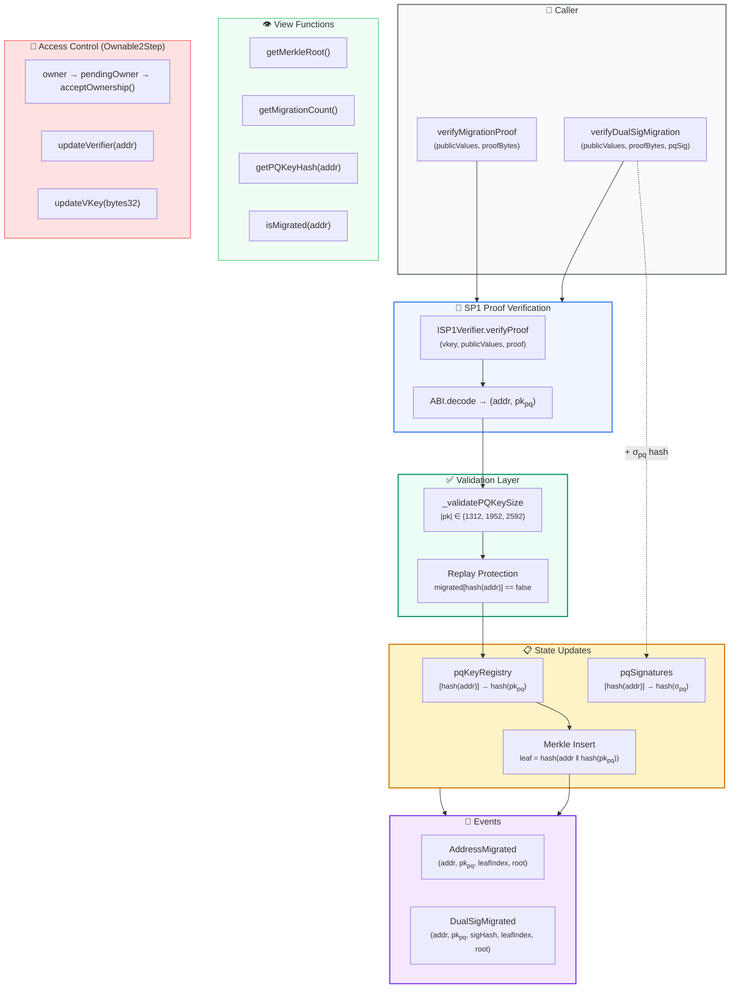
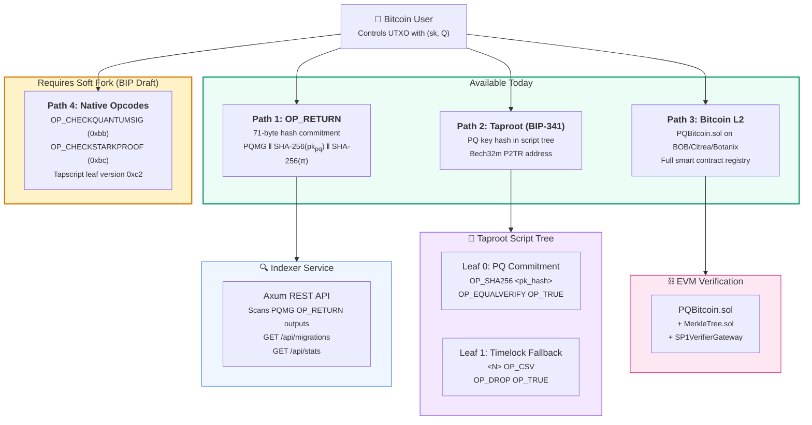
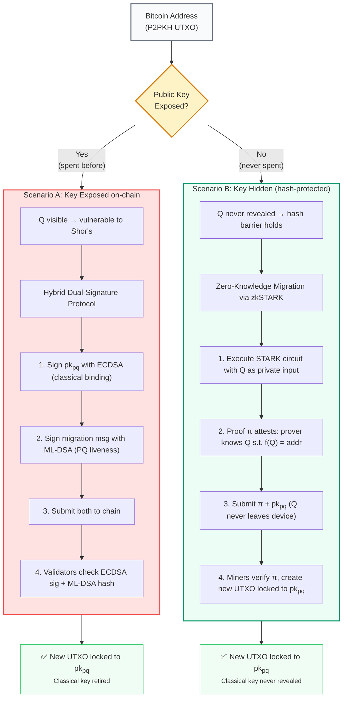
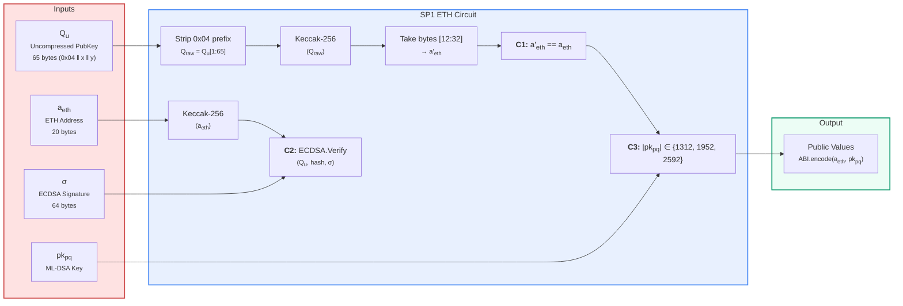

# PQ Bitcoin — Paper Diagrams (Mermaid)

> Paste each diagram into [mermaid.live](https://mermaid.live) to render and export as SVG/PNG for LaTeX.

---

## 1. zkSTARK Circuit — Bitcoin Migration (replaces `Securing-Coinbase-Txs.jpg`)

```mermaid
flowchart TB
    subgraph UTXO["🔗 Bitcoin UTXO"]
        addr["Address<sub>t</sub><br/><small>P2PKH (25 B)</small>"]
    end

    subgraph PQ["🛡️ Post-Quantum Key Generation"]
        pqgen["ML-DSA KeyGen<br/><small>FIPS-204</small>"]
        pkq["pk<sub>pq</sub><br/><small>1312 / 1952 / 2592 B</small>"]
        skq["sk<sub>pq</sub>"]
        pqgen --> pkq
        pqgen --> skq
    end

    subgraph PRIVATE["🔴 Private Inputs (Witness)"]
        direction LR
        pk_t["Q — Compressed PubKey<br/><small>secp256k1 (33 B)</small>"]
        sig_t["σ — ECDSA Signature<br/><small>compact (64 B)</small>"]
    end

    subgraph PUBLIC["🟢 Public Inputs (Statement)"]
        direction LR
        pub_addr["Address<sub>t</sub>"]
        pub_pkq["pk<sub>pq</sub>"]
    end

    subgraph CIRCUIT["⚡ SP1 zkSTARK Circuit"]
        direction TB
        c1["<b>C1: Address Binding</b><br/>a' = 0x00 ‖ RIPEMD-160(SHA-256(Q)) ‖ c₄<br/>assert a' == Address<sub>t</sub>"]
        c2["<b>C2: Ownership Proof</b><br/>m = SHA-256(\"PQ-MIG\" ‖ h₁₆₀ ‖ SHA-256(pk<sub>pq</sub>))<br/>assert ECDSA.Verify(Q, m, σ) == 1"]
        c3["<b>C3: PQ Key Validation</b><br/>assert |pk<sub>pq</sub>| ∈ {1312, 1952, 2592}"]
        c1 --> c2 --> c3
    end

    subgraph OUTPUT["📤 Circuit Output"]
        proof["π<sub>STARK</sub><br/><small>STARK Proof</small>"]
        commit["Public Values<br/><small>ABI.encode(addr, pk<sub>pq</sub>)</small>"]
    end

    UTXO --> |"derives"| PRIVATE
    addr --> |"public"| PUBLIC
    pkq --> |"public"| PUBLIC
    pk_t --> |"private"| CIRCUIT
    sig_t --> |"private"| CIRCUIT
    pub_addr --> CIRCUIT
    pub_pkq --> CIRCUIT
    CIRCUIT --> proof
    CIRCUIT --> commit

    subgraph SIGN["✍️ PQ Signing"]
        pqsig["σ<sub>pq</sub> = ML-DSA.Sign(sk<sub>pq</sub>, addr ‖ pk<sub>pq</sub>)"]
    end

    skq --> SIGN
    commit --> SIGN

    subgraph TX["📦 Migration Transaction"]
        direction LR
        tx_proof["π<sub>STARK</sub>"]
        tx_pkq["pk<sub>pq</sub>"]
        tx_sig["σ<sub>pq</sub>"]
        tx_addr["Address<sub>t</sub>"]
    end

    proof --> TX
    pkq --> TX
    SIGN --> TX
    addr --> TX

    style PRIVATE fill:#fee,stroke:#c44,stroke-width:2px
    style PUBLIC fill:#efe,stroke:#4a4,stroke-width:2px
    style CIRCUIT fill:#e8f0fe,stroke:#4285f4,stroke-width:2px
    style OUTPUT fill:#fef9e7,stroke:#f0b429,stroke-width:2px
    style TX fill:#f3e8ff,stroke:#7c3aed,stroke-width:2px
    style PQ fill:#ecfdf5,stroke:#059669,stroke-width:2px
    style UTXO fill:#f9fafb,stroke:#6b7280,stroke-width:2px
    style SIGN fill:#fff7ed,stroke:#ea580c,stroke-width:2px
```

---

## 2. End-to-End Proof Pipeline (SP1 → STARK → SNARK → On-Chain)

```mermaid
flowchart LR
    subgraph S1["Stage 1: Key Generation"]
        ecdsa["secp256k1<br/>KeyGen"]
        mldsa["ML-DSA-65<br/>KeyGen"]
        sign["ECDSA.Sign<br/>(sk, migration_msg)"]
        ecdsa --> sign
    end

    subgraph S2["Stage 2: zkVM Execution"]
        stdin["SP1Stdin<br/><small>Q, addr, σ, pk<sub>pq</sub></small>"]
        risc["RISC-V<br/>Execution<br/><small>541K cycles</small>"]
        trace["Execution<br/>Trace"]
        stdin --> risc --> trace
    end

    subgraph S3["Stage 3: STARK Proof"]
        air["AIR<br/>Constraints"]
        fri["FRI<br/>Folding"]
        stark["π<sub>STARK</sub>"]
        trace --> air --> fri --> stark
    end

    subgraph S4["Stage 4: SNARK Wrapping"]
        recurse["SP1<br/>Recursion"]
        groth["Groth16<br/><small>~260 B</small>"]
        plonk["PLONK<br/><small>~800 B</small>"]
        stark --> recurse
        recurse --> groth
        recurse --> plonk
    end

    subgraph S5["Stage 5: On-Chain Verification"]
        gateway["SP1Verifier<br/>Gateway"]
        contract["PQBitcoin.sol<br/><small>verifyMigrationProof()</small>"]
        merkle["Merkle<br/>Registry<br/><small>depth 20</small>"]
        groth --> gateway
        plonk --> gateway
        gateway --> contract --> merkle
    end

    S1 --> S2

    style S1 fill:#ecfdf5,stroke:#059669
    style S2 fill:#eff6ff,stroke:#3b82f6
    style S3 fill:#fef3c7,stroke:#d97706
    style S4 fill:#fce7f3,stroke:#db2777
    style S5 fill:#f3e8ff,stroke:#7c3aed
```



---

## 3. On-Chain Verification — PQBitcoin.sol Architecture



---

## 4. Bitcoin Multi-Path Migration Strategy



---

## 5. Migration Scenarios — Exposed vs. Unexposed Keys



---

## 6. Ethereum Circuit — Keccak-256 Derivation Path



---

## Usage

1. Copy any diagram block (everything between ` ```mermaid ` and ` ``` `)
2. Paste into [mermaid.live](https://mermaid.live)
3. Export as **SVG** (vector, best for LaTeX) or **PNG**
4. Include in LaTeX:
   ```latex
   \includegraphics[width=0.85\textwidth]{imgs/diagram-name.pdf}
   ```
   (convert SVG → PDF via `inkscape` or `rsvg-convert` for best LaTeX quality)
